# EEG Challenge 2025 - Modular EEG Pretraining and Fine-tuning Framework

🚀 **EEG Challenge 2025**  
This repository provides a complete, modular deep learning framework for **EEG-based transfer learning**, following the structure and methodology used in the official **EEG Challenge 2025 (HBN Dataset)**.  

The project focuses on **self-supervised pretraining** on the *Surround Suppression (SuS)* task and **fine-tuning** on the *Contrast Change Detection (CCD)* task, aligning with the official competition setup.

---

## 🧠 Overview

This repository enables:
- Self-supervised pretraining of EEG backbones (using contrastive learning).
- Transfer learning and fine-tuning for downstream classification/regression tasks.
- Modular design with Braindecode-based EEG processing and PyTorch backbones.
- Reproducible configuration and testing framework (`config.py`).

---

### 🏗️ Global Pipeline

```mermaid
graph LR
    %% Global Styles
    classDef data fill:#e1f5fe,stroke:#01579b,stroke-width:2px;
    classDef process fill:#fff9c4,stroke:#fbc02d,stroke-width:2px;
    classDef model fill:#e8f5e9,stroke:#2e7d32,stroke-width:2px;
    classDef storage fill:#f3e5f5,stroke:#7b1fa2,stroke-width:2px,stroke-dasharray: 5 5;

    %% --- DATA INGESTION ---
    subgraph Data_Ingestion [Data Ingestion]
        direction TB
        A["<b>HBN Dataset (BIDS)</b><br/>Raw EEG (.set)"]:::data --> B["<b>Preprocessing</b><br/>0.5-40Hz BP Filter<br/>Resample 100Hz<br/>Clip ±500μV"]:::process
        B --> C{Task Selector}
    end

    %% --- STAGE 1 ---
    subgraph Stage_1 [Stage 1: Pretraining]
        direction TB
        D["<b>Windowing</b><br/>Fixed Length 2s<br/>(Unlabeled)"]:::process --> E["<b>Contrastive Learning</b><br/>SimCLR Framework"]:::model
        E --> F(("<b>Save Backbone</b><br/>Weights")):::storage
    end

    %% --- STAGE 2 ---
    subgraph Stage_2 [Stage 2: Fine-Tuning]
        direction TB
        G["<b>Trial Reconstruction</b><br/>Link Stimulus → Response<br/>Calc: RT"]:::process --> H["<b>Transfer Learning</b><br/>Frozen Backbone + Regressor"]:::model
        H --> I["<b>Prediction</b><br/>Reaction Time (ms)"]:::data
    end

    %% --- CONNECTIONS ---
    C -- "Surround Suppression (SuS)" --> D
    C -- "Contrast Change Detection (CCD)" --> G
    F -.->|Load Weights| H
```




### 🧠 Detailed Architecture Flow


## 📂 Repository Structure

```
EEG-Challenge-2025/
│
├── config.py               # Centralized configuration for data paths and hyperparameters
├── data_loader.py          # Data loading utilities for BIDS-structured EEG datasets
├── preprocessing.py        # Preprocessing and windowing utilities
├── model.py                # EEGNeX backbone and TransferLearner model definitions
├── engine.py               # Training, validation, and evaluation loops
├── lr_finder.py            # Learning Rate Finder (optional, non-blocking)
│
├── pretrain.py             # Stage 1: Self-supervised pretraining on SuS task
├── main.py                 # Stage 2: Fine-tuning on CCD task
│
├── artifacts/              # Directory for saving LR plots, pretrained and fine-tuned models
├── requirements.txt        # Python dependencies
└── README.md               # Project documentation
```

---

## 🧩 Datasets

This project is designed for use with the **Healthy Brain Network (HBN) EEG dataset**, as used in the **official EEG Challenge 2025**.

📥 **Dataset Access:**  
The EEG data can be accessed through the official [HBN EEG Dataset](https://fcon_1000.projects.nitrc.org/indi/cmi_healthy_brain_network/) website.  
Follow the EEG Challenge rules and guidelines to download and organize data in BIDS format under the folder specified in:
```python
Config.DATA_ROOT = Path(r"G:\TA_work\EEG Competition\Modular_code\data")
```

> **Note:** Replace the `DATA_ROOT` path in `config.py` with your local dataset directory.

---

## ⚙️ Installation

1. **Clone the repository**
   ```bash
   git clone https://github.com/chetanrakshe2510/EEG-Foundation-Model.git
   cd EEG-Challenge-2025
   ```

2. **Create and activate a virtual environment**
   ```bash
   python -m venv eeg_env
   source eeg_env/bin/activate      # On Windows: eeg_env\Scripts\activate
   ```

3. **Install dependencies**
   ```bash
   pip install -r requirements.txt
   ```

---

## 🧪 Running the Pipeline

### 🏁 **Stage 1: Pretraining**
Run self-supervised pretraining on the *Surround Suppression* (SuS) task:
```bash
python pretrain.py
```
- Saves pretrained weights to `artifacts/pretrained_backbone.pth`
- Optionally saves LR Finder plot to `artifacts/lr_find_pretrain.png` (if enabled in `config.py`)

### 🔁 **Stage 2: Fine-tuning**
Fine-tune the pretrained model on the *Contrast Change Detection* (CCD) task:
```bash
python main.py
```
- Loads pretrained backbone from `artifacts/pretrained_backbone.pth`
- Saves fine-tuned model as `artifacts/best_finetuned_model.pth`

---

## ⚡ Configuration

All project parameters (paths, frequencies, hyperparameters, etc.) are defined in `config.py`.

| Parameter | Description | Default |
|------------|--------------|----------|
| `DATA_ROOT` | Root path to BIDS-formatted EEG data | `G:\TA_work\EEG Competition\Modular_code\data` |
| `PRETRAIN_TASK` | Pretraining task name | `surroundSupp` |
| `FINETUNE_TASK` | Fine-tuning task name | `contrastChangeDetection` |
| `USE_LR_FINDER` | Enables LR Finder plots | `False` |
| `SAVE_PATH` | Directory to save models and plots | `artifacts/` |

To run a fast debug mode:
```python
from config import get_config
Config = get_config(test_mode=True)
```

---

## 🧠 Model Architecture

- **Backbone:** EEGNeX (adapted from Braindecode 1.3)
- **Pretraining:** Contrastive self-supervised loss (`NT-Xent`)
- **Fine-tuning:** Regression on reaction time (`rt_from_stimulus`)
- **Framework:** PyTorch + Braindecode

---

## 📈 Outputs

- Pretrained model: `artifacts/pretrained_backbone.pth`
- Fine-tuned model: `artifacts/best_finetuned_model.pth`
- LR Finder plots:  
  - `artifacts/lr_find_pretrain.png`  
  - `artifacts/lr_find_finetune.png`

---

## 🗾 Citation

If you use this framework or build upon it, please cite the **EEG Challenge 2025** and the **HBN dataset**:

```
@dataset{hbn_eeg_2025,
  title = {Healthy Brain Network EEG Dataset},
  author = {Alexander et al.},
  year = {2025},
  publisher = {Child Mind Institute},
  url = {https://fcon_1000.projects.nitrc.org/indi/cmi_healthy_brain_network/}
}
```

---

## 🤝 Contributions

Pull requests and discussions are welcome!  
Please ensure changes are consistent with the challenge rules and modular pipeline design.

---

## 📄 License

This repository is released under the **MIT License**.  
Feel free to use, modify, and distribute with attribution.


